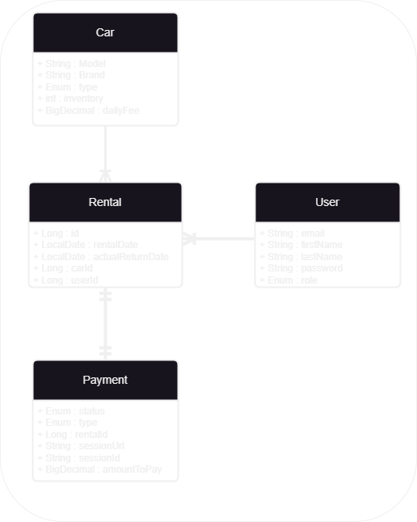

# 🚗 Car Sharing Service 🚗

The Car Sharing Service is a web application that allows users to rent cars from a car sharing service. It provides a set of APIs for managing cars, users, rentals, and payments. The service also offers Telegram notifications for new rentals and overdue rentals, as well as integration with Stripe for payment processing.

## Table of Contents

- [Introduction](#introduction)
- [Technologies Used](#technologies-used)
- [Getting Started](#getting-started)
    - [Prerequisites](#prerequisites)
    - [Installation](#installation)
- [API Endpoints and permissions](#api-endpoints)
- [Telegram Notifications](#telegram-notifications)
- [Testing](#testing)
- [Contribution Guidelines](#contribution-guidelines)

## Introduction

The Car Sharing Service aims to provide an efficient and user-friendly platform for renting cars. It caters to both customers and administrators, allowing customers to browse available cars, make reservations, and process payments securely, while administrators can manage car inventory, user roles, and track payments.

## 💻 Technologies Used

The following technologies are used to build the Car Sharing Service:

- **Java**: The primary programming language used for the application.
- **Spring Boot**: A powerful framework that provides essential features for building web applications.
- **Spring Data JPA**: Simplifies data access and persistence with JPA (Java Persistence API).
- **Spring Security**: Enables robust and secure authentication and authorization mechanisms.
- **MySQL**: The database management system used for data storage.
- **Stripe API**: Integrated with Stripe for secure payment processing.
- **Telegram API**: Used to send notifications to administrators via Telegram.
- **MapStruct**: Simplifies object mapping between DTOs and entities.
- **Docker**: Used for containerization of the application and database.
- **Lombok**: Reduces boilerplate code with annotations.
- **Swagger**: Provides API documentation.

## 🚀 Getting Started

### Prerequisites

Before running the Car Sharing Service, ensure you have the following installed:

- Java Development Kit (JDK)
- Docker and Docker Compose

### Installation

1. Clone the repository from GitHub and navigate to the project directory.

2. Create a `.env` file with the necessary environment variables. (See `.env.sample` for a sample.)

3. Run the following command to build and start the Docker containers:

   `docker-compose up --build`.

4. The application should now be running at `http://localhost:8080`.

## 💾 Database structure

## 🔗 API Endpoints

The Car Sharing Service provides the following API endpoints:

<!-- Fill in the details for each endpoint as per your project's requirements -->

| **HTTP method** | **Endpoint**                   | **Role**   | **Function**                                     |
|:----------------|:-------------------------------|------------|:-------------------------------------------------|
| POST            | /register                      | ALL        | Register a new user.                            |
| POST            | /login                         | ALL        | Get JWT tokens for authentication.              |
| PUT             | /users/{id}/role               | ADMIN      | Update user role.                               |
| GET             | /users/me                      | ALL        | Get current user's profile info.                |
| PUT             | /users/me                      | ALL        | Update current user's profile info.             |
| POST            | /cars                          | ADMIN      | Add a new car.                                  |
| GET             | /cars                          | ALL        | Get a list of all cars.                         |
| GET             | /cars/{id}                     | ALL        | Get detailed information about a car.           |
| PUT             | /cars/{id}                     | ADMIN      | Update a car's information.                     |
| DELETE          | /cars/{id}                     | ADMIN      | Delete a car.                                   |
| POST            | /rentals                       | ALL        | Add a new rental.                               |
| GET             | /rentals                       | ADMIN/USER | Get rentals by user ID and rental status.       |
| GET             | /rentals/{id}                  | ADMIN/USER | Get specific rental by ID.                      |
| POST            | /rentals/{id}/return           | ADMIN/USER | Set actual return date for a rental.            |
| POST            | /payments                      | ALL        | Create a payment session for a rental.          |
| GET             | /payments                      | ADMIN/USER | Get payments by user ID.                        |
| GET             | /payments/success              | ALL        | Endpoint for handling successful Stripe payments. |
| GET             | /payments/cancel               | ALL        | Endpoint for handling canceled Stripe payments.  |

## 🤖 Telegram Notifications

The Car Sharing Service sends Telegram notifications for the following events:

- New rental created: Notifications are sent to all service administrators.
- Overdue rental: If a rental is overdue (return date is in the past, and the car is still not returned), notifications are sent to all service administrators.

## 📄 Contribution Guidelines

We welcome contributions to this project. Please create a new branch for each feature or bug fix and submit a pull request to the `main` branch. All PRs must be reviewed and approved by at least two team members before merging.

